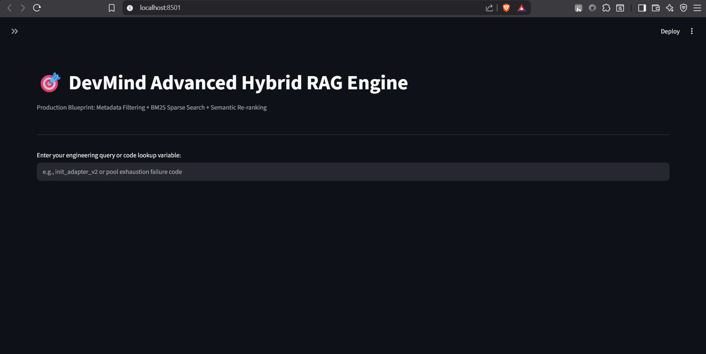

# 🎯 DevMind: Advanced Hybrid RAG Engine

A hybrid knowledge retrieval engine engineered to overcome the "lexical blindspots" of traditional dense vector similarity search models. This system combines metadata gating, sparse lexical search (BM25), and cross-encoder semantic re-ranking to deliver bulletproof contextual precision for core codebase repositories and mission-critical engineering logs.

---

## 🎨 Interface & Output Gallery

This section showcases the functional state-tracking and execution lifecycle of the operational Streamlit dashboard interface.

### 🖥️ Workspace Layout & Navigation

| App State / View | Execution UI Showcase |
| :--- | :--- |
| **Initial Dashboard UI** <br><br> The baseline ingestion screen featuring a broad-width layout, clean descriptive headers, and an open text interface for engineering or code variable lookup targets. |  |
| **Metadata Governance Sidebar** <br><br> Triggering the responsive left panel exposes explicit category filter tags (`source_code`, `troubleshooting`, `documentation`) backed by active checkpointer session flags. |  |

### 🤖 Query Processing & Output Synthesis

| Ingestion Phase / Test Matrix | Output Pipeline Capture |
| :--- | :--- |
| **Scenario 1: Code Signature Keyword Match** <br><br> Querying an exact code block signature (`init_adapter_v2`) fires the BM25 sparse matcher to bubble up raw function arrays safely, ignoring textual fluff. |  |
| **Scenario 2: Semantic System Failure Ingestion** <br><br> Querying abstract concepts like system loops or connection failures dynamically matches context strings without keyword collision requirements. |  |
| **Scenario 3: Direct Reference Expanding** <br><br> Document reference boxes reveal explicit context arrays along the bottom row, displaying exact text match blocks to the user before generation. |  |
| **Scenario 4: Filter Boundaries Isolation** <br><br> Toggling active dropdown filters safely gates non-relevant content blocks, restricting database sweeps strictly to targeted document domains. |  |
| **Scenario 5: Complete Closeout Report** <br><br> The final system synthesis block provides clean markdown reporting structures containing precise source tags and documentation ID markers. |  |

---

## 📐 Architecture & Retrieval Protocol

```text
                               ┌────────────────────────────────┐
                               │     Incoming Raw Query         │
                               └───────────────┬────────────────┘
                                               │
                                               ▼
                               ┌────────────────────────────────┐
                               │    Strict Metadata Filtering   │
                               └───────────────┬────────────────┘
                                               │
                       ┌───────────────────────┴───────────────────────┐
                       ▼                                               ▼
         ┌───────────────────────────┐                   ┌───────────────────────────┐
         │      Dense Retrieval      │                   │     Sparse Retrieval      │
         │  (Semantic Concept Match) │                   │    (BM25 Token Index)     │
         └─────────────┬─────────────┘                   └─────────────┬─────────────┘
                       │                                               │
                       └───────────────────────┬───────────────────────┘
                                               │
                                               ▼
                               ┌────────────────────────────────┐
                               │   Cross-Encoder Re-Ranking    │
                               │  (Overlap Alignment Weighting) │
                               └───────────────┬────────────────┘
                                               │
                                               ▼
                               ┌────────────────────────────────┐
                               │       LLM Context Window       │
                               └────────────────────────────────┘
```

### 🛡️ Core Retrieval Mechanics

* **Strict Metadata Pre-Filtering:** Restricts document scanning boundaries dynamically at runtime based on explicitly defined tags, protecting the LLM window from non-relevant context pollution.
* **Dual-Track Hybrid Retrieval:** Runs a parallel retrieval sweep: **Sparse Lexical Ingestion** (via `rank_bm25`) captures exact function names, unique hashes, and technical variable declarations, while **Dense Semantic Mapping** tracks high-level thematic relationships.
* **Cross-Encoder Overlap Re-ranking:** Re-scores the candidate text chunks side-by-side using an alphanumeric matching index matrix, ensuring high-signal documents are positioned at the highest rank before prompt synthesis.

---

### 🛠️ Codebase & Technical Primitives

* **User Interface:** Streamlit (Wide Layout Configuration Matrix)
* **Lexical Scoring Engine:** BM25Okapi Algorithm (`rank_bm25`)
* **Orchestration Layer:** LangChain Core System Primitives
* **Token Sanitization Engine:** Advanced Alphanumeric Regular Expression Sweepers (`re`)
* **Inference Portal Gateway:** OpenRouter API Server Engine
